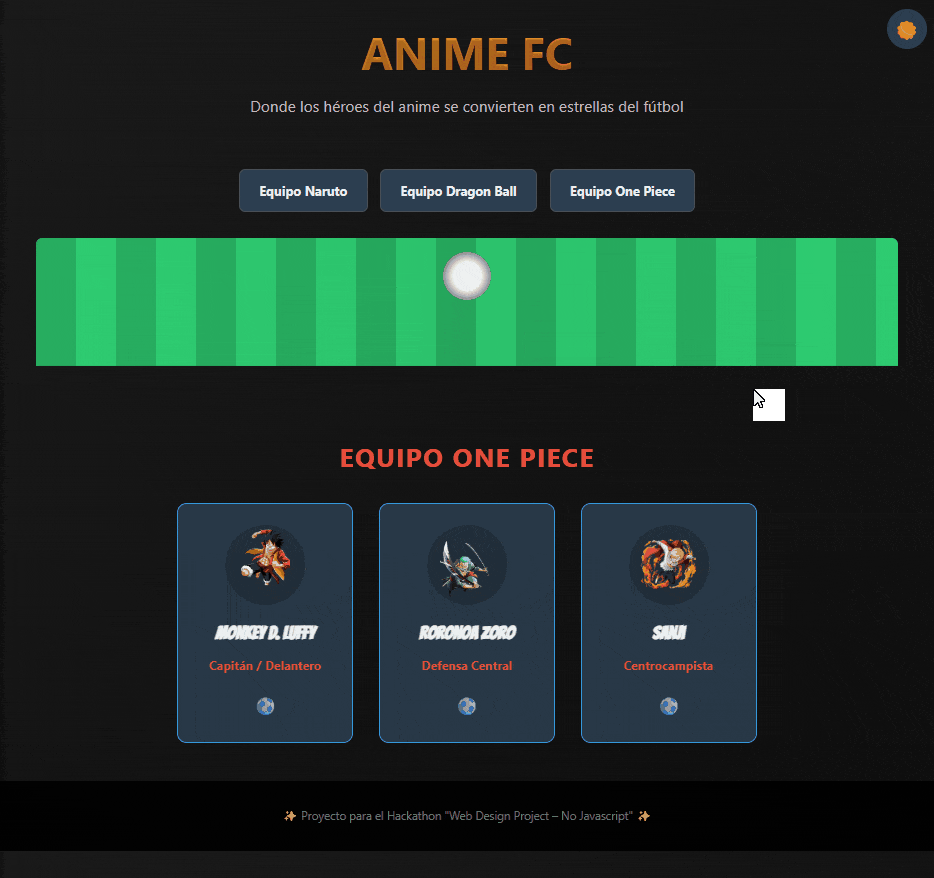

# ⚽ Anime FC ⚽


Un proyecto 100% **HTML y CSS puro** para el hackathon "Web Design Project", donde los héroes del anime se convierten en estrellas del fútbol en una experiencia web interactiva y moderna.



---

## 🚀 Demo en Vivo

**Prueba el proyecto aquí: https://diegojgs.github.io/anime-fc-hackathon/**

---

## ✨ Características Principales

* **Selector de Equipos Dinámico:** Navega entre 3 equipos temáticos (Naruto, Dragon Ball, One Piece) con un sistema de pestañas hecho solo con CSS.
* **Tarjetas de Jugador 3D Interactivas:** Al pasar el mouse, las tarjetas giran sobre su eje para revelar las estadísticas de cada jugador.
* **Interruptor de Tema (Claro/Oscuro):** Un interruptor funcional que cambia la paleta de colores de toda la página sin una sola línea de JavaScript.
* **Efectos Atmosféricos y Animaciones:**
    * Animaciones de entrada suaves al cambiar de equipo.
    * Efecto de "luz de estadio" que ilumina las tarjetas al pasar el mouse.
    * Movimiento sutil de "viento" en el césped del campo.
* **Micro-interacciones:** Pequeños detalles como el marcador de gol animado y el crecimiento del campo al hacer hover.
* **Diseño Totalmente Responsivo:** Se adapta perfectamente a computadoras, tabletas y móviles.

---

## 🛠️ Técnicas CSS Avanzadas Utilizadas

Este proyecto fue un desafío para llevar HTML y CSS al límite. Algunas de las técnicas clave son:

* **Checkbox Hack:** Utilizado como "cerebro" para manejar la lógica del selector de equipos y el interruptor de tema.
* **Variables CSS (Custom Properties):** Para una gestión de temas y colores modular, permitiendo el cambio de paleta de claro a oscuro.
* **Transformaciones 3D:** Uso de `perspective`, `transform-style: preserve-3d` y `rotateY` para el efecto de giro de las tarjetas.
* **Animaciones con `@keyframes`:** Para dar vida a la pelota, el viento, la luz de estadio y el marcador de goles.
* **Selectores Avanzados:** Uso intensivo del combinador de hermanos (`~`) y la pseudo-clase `:checked` para crear interactividad compleja.
* **`clip-path`:** Para la animación interactiva del campo de fútbol.
* **Flexbox:** Para la maquetación moderna y responsiva de las tarjetas y otros elementos.
* **Pseudo-elementos (`::before`, `::after`):** Para añadir efectos visuales sin sobrecargar el HTML.

---

## 💻 Cómo Ejecutar Localmente

1.  Clona el repositorio:
    ```bash
    git clone https://github.com/diegojgs/anime-fc-hackathon.git
    ```
2.  Abre el archivo `index.html` en tu navegador.
